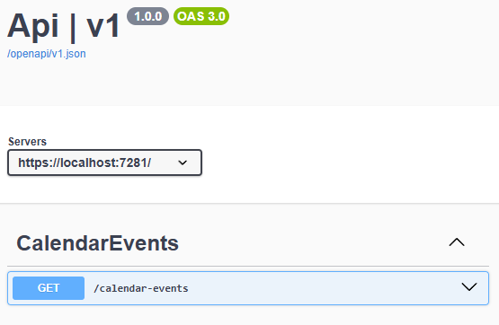

# BI Calendar Events API

This project is an ASP.NET Core Minimal API for fetching and serving calendar events from BI Norwegian Business School.

## Features

- **Fetch Calendar Events:**  
  Exposes a `/calendar-events` endpoint that proxies and filters events from [https://bi.no/api/calendar-events](https://bi.no/api/calendar-events) with support for:
  - `take` (int): Number of events to fetch (default: 5)
  - `language` (string): Language filter (`no`, `en`, `all`)
  - `campus` (string): Campus filter
  - `audience` (string): Audience filter (e.g., Bachelor, Master, Executive)

- **Validation:**  
  Query parameters are validated for allowed values and ranges.

- **Caching:**  
  Uses FusionCache to cache event data for efficient repeated access, as event data changes infrequently.

- **Configuration:**  
  Loads configuration from Azure App Configuration and resolves secrets from Azure Key Vault using managed identity or your user (`DefaultAzureCredential`).

- **Error Handling:**  
  Centralized exception handling with consistent problem details responses.

- **API Documentation:**  
  Integrated Swagger/OpenAPI UI for easy exploration and testing of the API.

## Getting Started

### Prerequisites

- [.NET 9 SDK](https://dotnet.microsoft.com/)
- Access to Azure App Configuration and Azure Key Vault (with managed identity or your user with appropriate RBAC permissions)

### Configuration

1. **Set Azure App Configuration Endpoint**  
   Add the following to your environment variables or `appsettings.json`: { "AppConfig": { "Endpoint": "https://<your-app-config-name>.azconfig.io" } }

### Running the API

The API will be available at `https://localhost:7281` (or as configured).

### API Documentation

Swagger UI is available at `/swagger` in development mode.

## Project Structure

- `Api/Program.cs` – Application startup, configuration, and service registration
- `Api/Features/CalendarEvents/FetchMultiple.cs` – Calendar events endpoint, request/response models, and validation
- `Api/Exceptions/ExceptionHandler.cs` – Centralized exception handling
